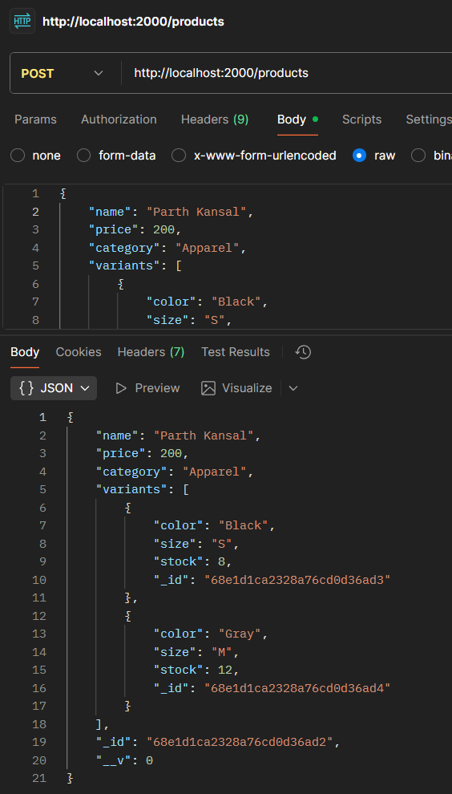
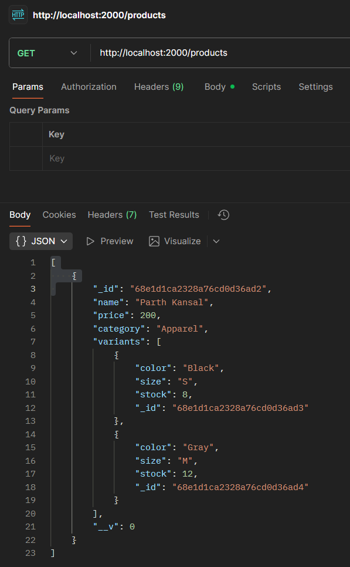

# E-commerce Catalog with Nested Documents (MongoDB & Node.js)

## Project Overview
This project demonstrates a simple e-commerce catalog using **Node.js**, **Express**, and **MongoDB** with **nested documents** for product variants.  
Each product has fields like `name`, `price`, `category`, and an array of `variants` containing `color`, `size`, and `stock`.

## Features
- Add a new product with multiple variants
- Retrieve all products
- Filter products by category
- Filter products by variant color

## Prerequisites
- Node.js installed
- MongoDB installed and running locally (or MongoDB Atlas account)
- Postman (for API testing)

## Installation & Setup
1. Install all the dependencies that a project needs
```bash
npm install
```
2. Start MongoDB (if using local MongoDB):
```bash
mongod
```
3. Run the server:
```bash
node server.js
```
## Code
### script.js
```js
const express = require('express');
const mongoose = require('mongoose');
const bodyParser = require('body-parser');

const app = express();
app.use(bodyParser.json());

mongoose.connect('mongodb://127.0.0.1:27017/ecommerce')
    .then(() => console.log('MongoDB connected'))
    .catch(err => console.log(err));

const variantSchema = new mongoose.Schema({
    color: String,
    size: String,
    stock: Number
});

const productSchema = new mongoose.Schema({
    name: String,
    price: Number,
    category: String,
    variants: [variantSchema]
});

const Product = mongoose.model('Product', productSchema);

app.post('/products', async (req, res) => {
    try {
        const product = new Product(req.body);
        await product.save();
        res.send(product);
    } catch (err) {
        res.status(400).send(err);
    }
});

app.get('/products', async (req, res) => {
    try {
        const products = await Product.find();
        res.send(products);
    } catch (err) {
        res.status(500).send(err);
    }
});

app.get('/products/category/:category', async (req, res) => {
    try {
        const products = await Product.find({ category: req.params.category });
        res.send(products);
    } catch (err) {
        res.status(500).send(err);
    }
});

app.get('/products/by-color/:color', async (req, res) => {
    try {
        const products = await Product.find({ 'variants.color': req.params.color });
        res.send(products);
    } catch (err) {
        res.status(500).send(err);
    }
});

app.listen(3000, () => console.log('Server running on port 3000'));
```

## API Endpoints

| Method | Endpoint                        | Description                       |
|--------|---------------------------------|-----------------------------------|
| GET    | /products                       | Get all products                  |
| GET    | /products/category/:category    | Get products by category          |
| GET    | /products/by-color/:color       | Get products by variant color     |
| POST   | /products                       | Add a new product                 |

## Screen Shots
### 1. Add a new product (POST)


### 2. Get all products

